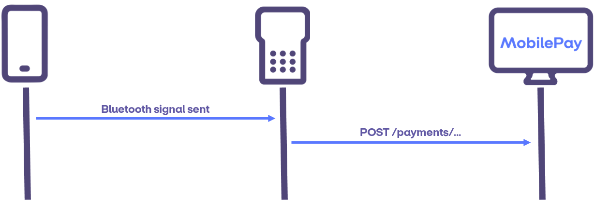
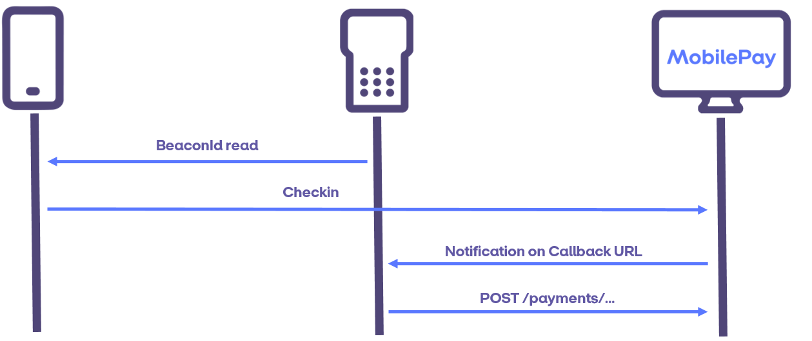

#  Detecting MobilePay

There are three ways in MobilePay PoS for a terminal/client to become aware that MobilePay has been chosen by the customer as the payment option: User activation, Notification service and BLE 2-way communication.

##  User activation

This is the default way of detecting MobilePay presence. In a supermarket, this can be a button on the ECR (Electronic Cash Register) that sends the payment request to MobilePay. For example, the cashier will ask the customer or infer from the customer's actions which payment option the customer wants to choose and then push the MobilePay button. Another example of user activation is when the customer can choose MobilePay themselves on a keypad placed on a vending machine for instance. Some vending machines only allow MobilePay to be used and therefore any request for the vending machine product would be inferred as a payment request to MobilePay.

A last example of a user activation is in the case of a QR code being displayed in a terminal. Once the QR code is displayed,
the terminal may start polling the endpoint ``GET /api/v10/pointofsales/{posId}/checkin`` to determine if a customer has checked in. The terminal may only poll for a check-in while the QR code is displayed on the terminal to ensure the check-in endpoint is not overloaded with requests.

##  BLE 2-way communication

It is possible to get information about check-ins via Bluetooth Low Energy. To use this approach the integrator will need to use one of the MobilePay defined Bluetooth communication protocols.

##  Notification service

Some interfaces do not naturally include a possibility for user activation - in these cases an endpoint can be exposed by the MobilePay PoS integrator. This endpoint will be called with a check-in notification when a customer checks in. After receiving a notification the client can poll the ``GET /api/v10/pointofsales/{posId}/checkin`` endpoint for that PoS. For more details see [Notification Service](notification_service).

