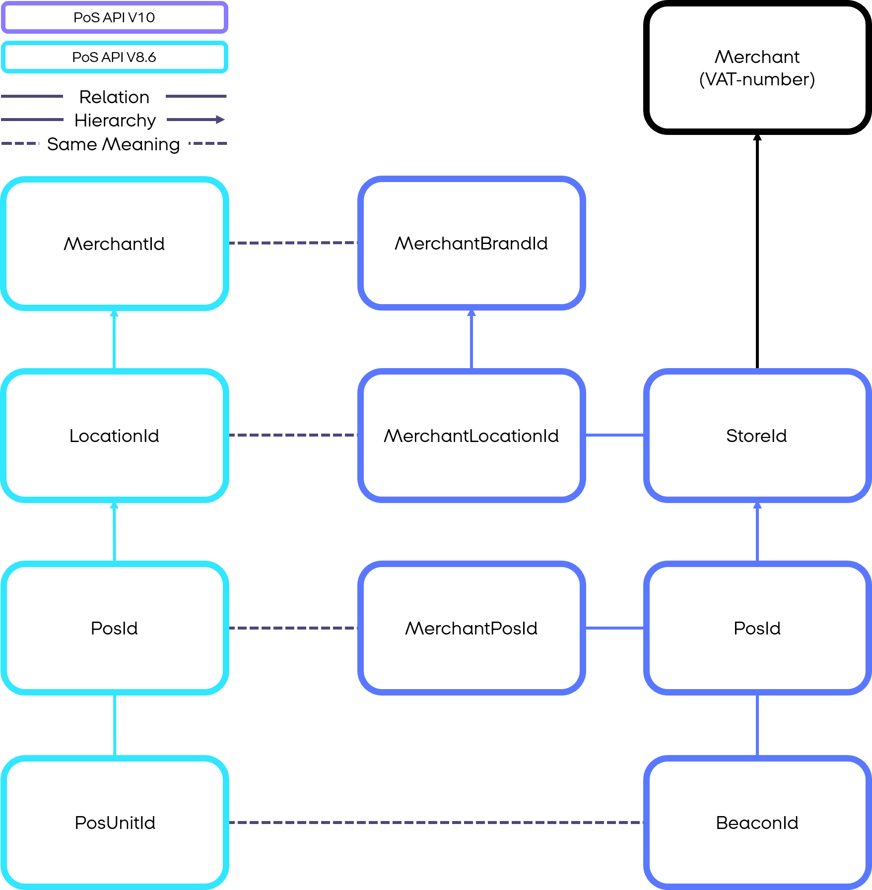

## Overview of changes between version 10 and version 8.6 of the MobilePay PoS API

Version 10 of the MobilePay PoS API introduces breaking changes from version 8.6 of the API. 
The following list describes the changes in overview:

Notable changes from Version 8.6 to Version 10 of the MobilePay PoS API
* Clients need to implement HTTP 1.1 and JSON standards
* Security setup has changed
  * No API key and HMAC validation
  * Use of access tokens
  * Vendor Identification and Version numbering
* The Error messages are more informative
* There are changes to the payment flow
  * Inclusion of the Prepare-Ready flow
  * It is only possible to do Reservation-Capture flows
  * API method naming has changed
* There is a new ID-structure
* Documentation is live through a developer website (using OpenAPI standards) and GitHub
* Certification will be done automatically
* Possibility to do age verification for purchases

## ID-hierarchy

The following diagram shows the ID-Hierarchy of the Master data in MobilePay PoS.

