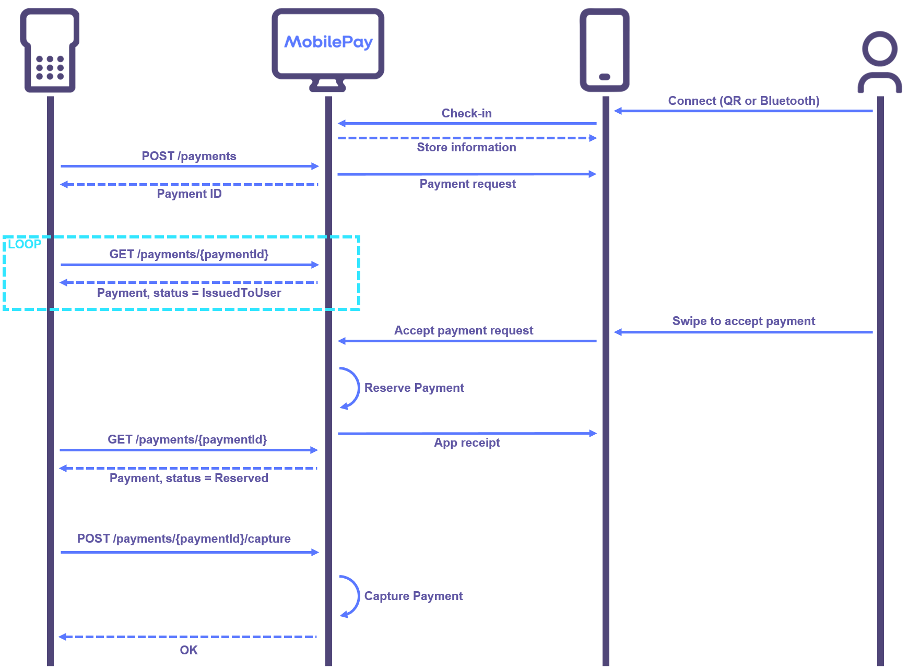
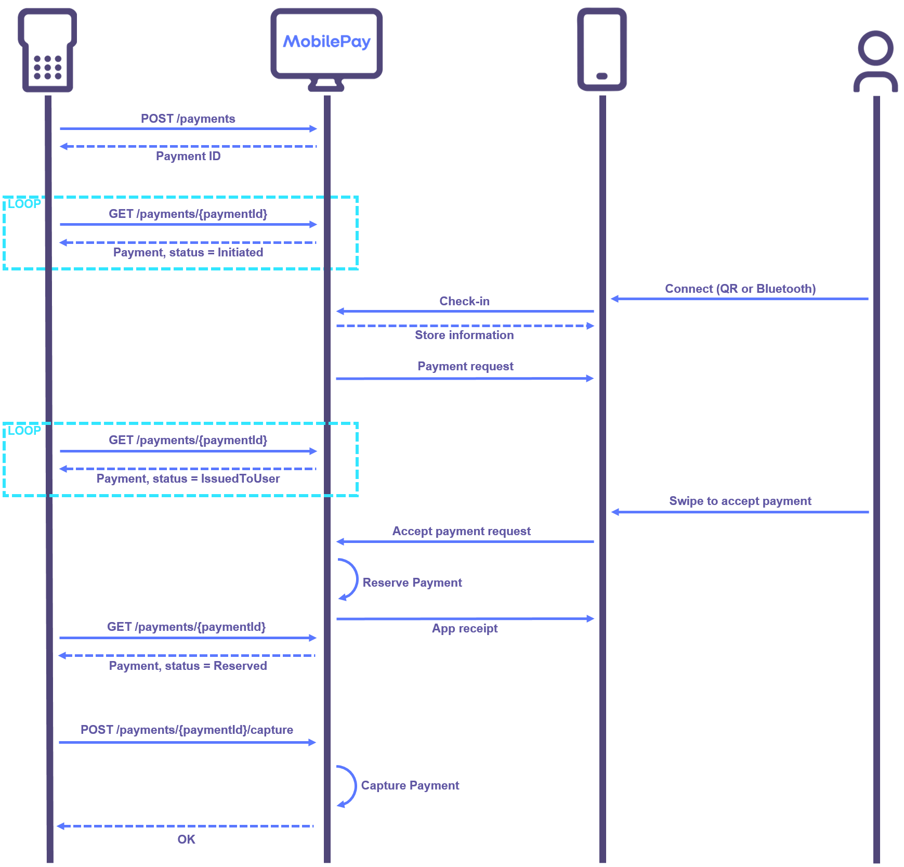
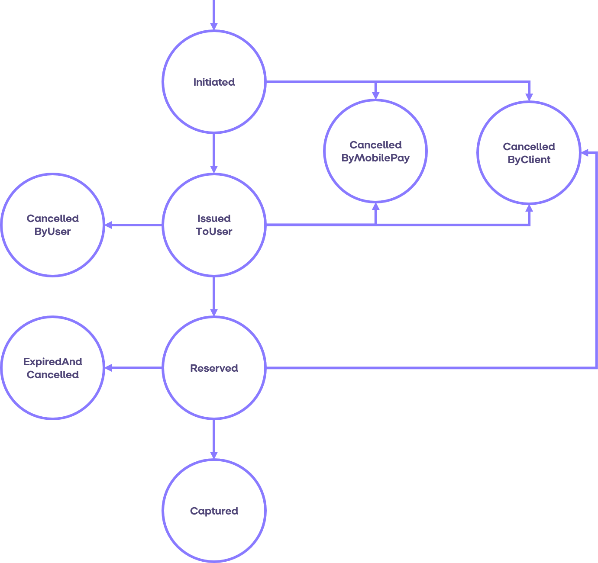
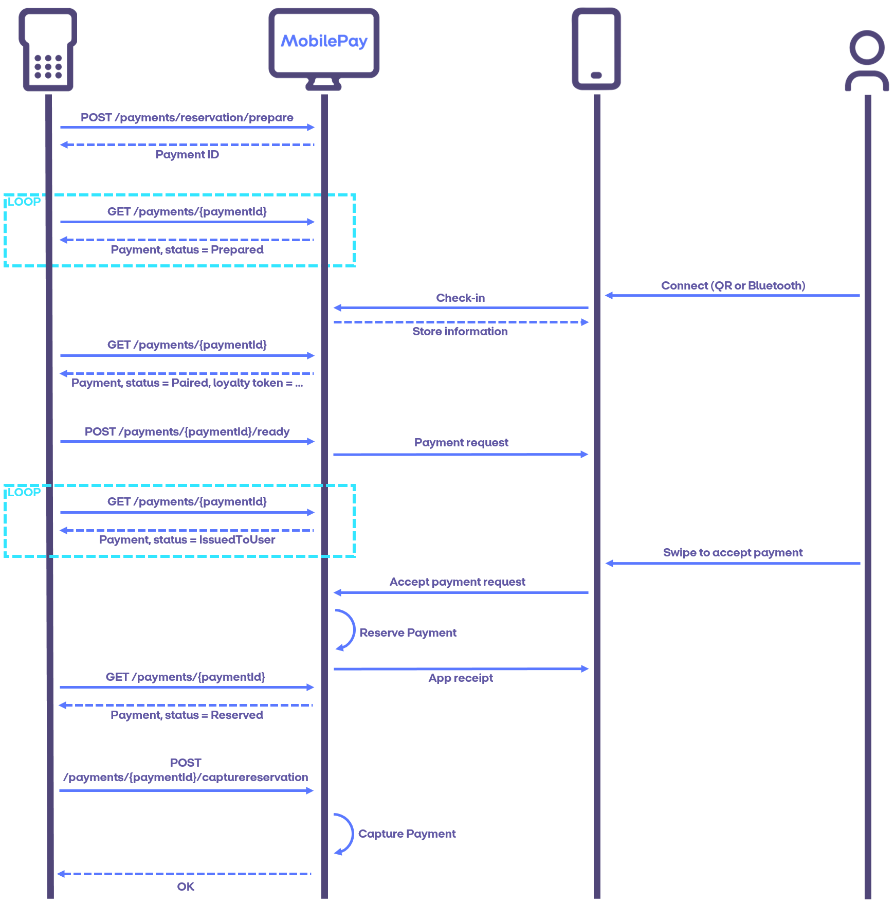
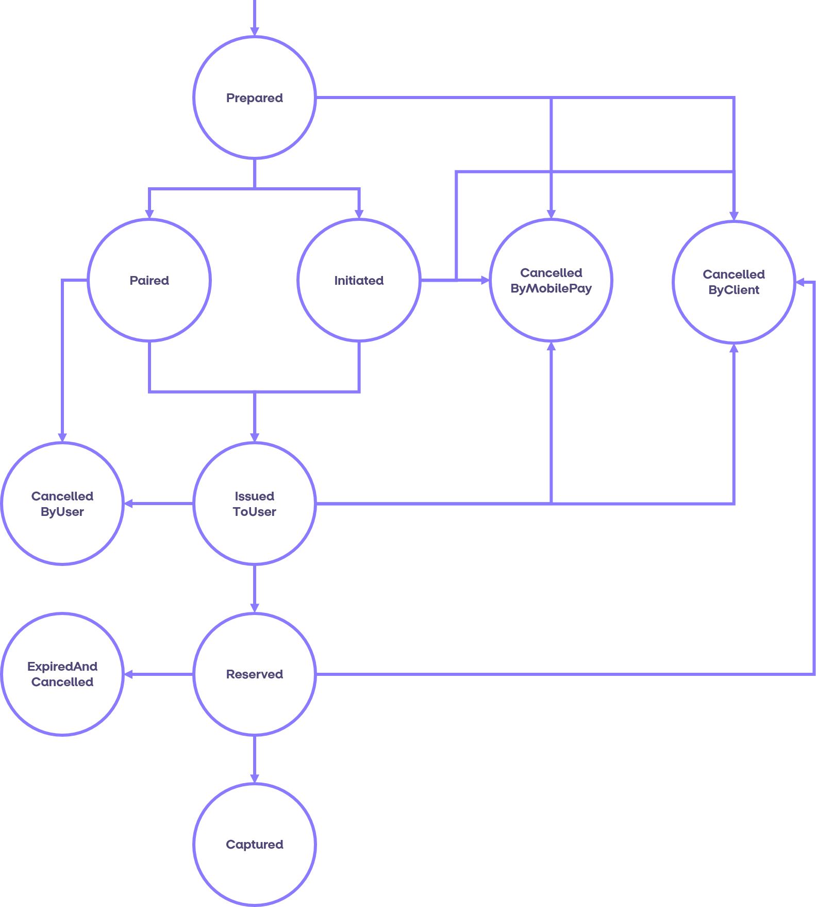
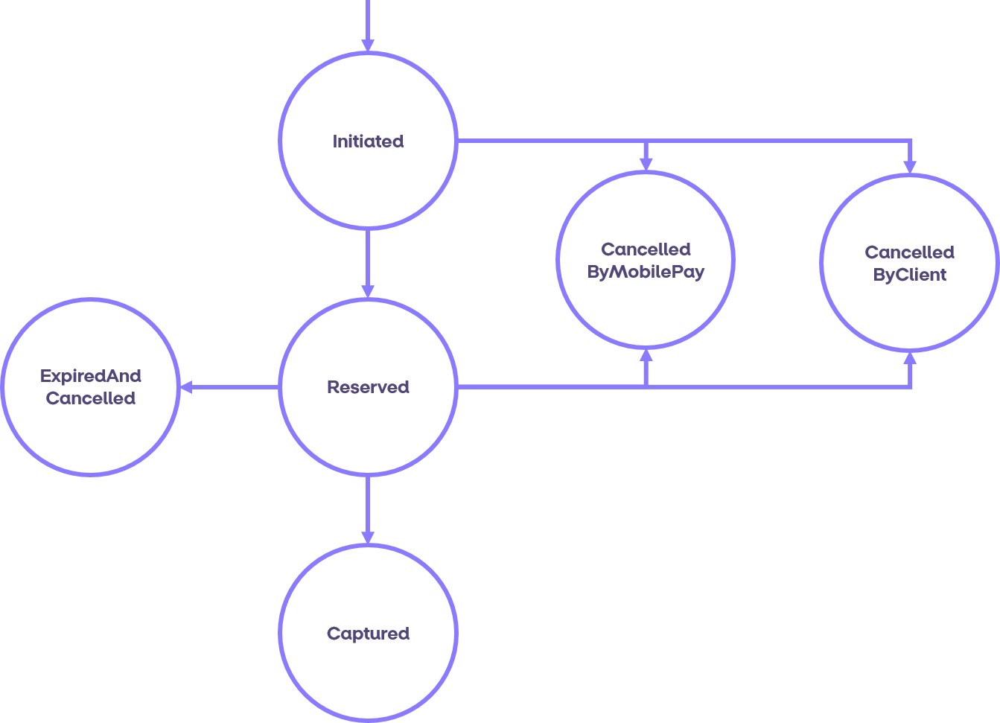
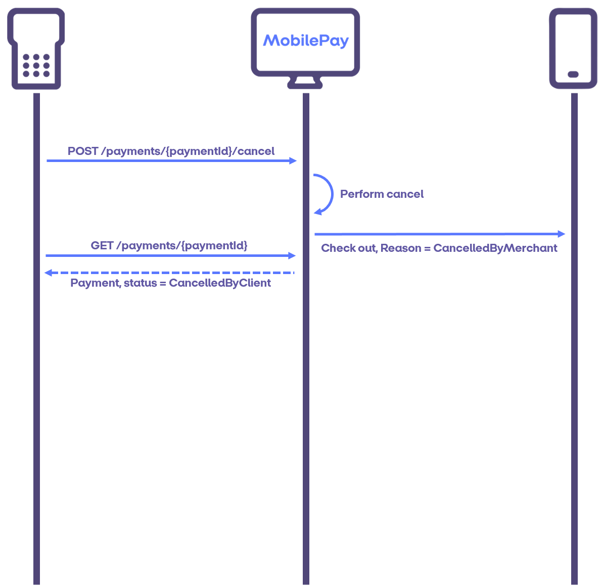

# Payment Flows

The MobilePay PoS API exposes two separate flows for payments which are documented in this section. All payments must be explicitly captured by the client after the customer has approved the payment. The capture amount can be for the full or a partial amount.

For a client to start a payment flow, the client first has to detect that a customer is present, ready and willing to pay. In the following descriptions of payment flows it is assumed that the client has already detected a customer. How to detect a customer wanting to pay with MobilePay is described in the [Detecting MobilePay](detecting_mobilePay) section. 

## Payment Flow

The payment flow makes the payment ready for customer approval immediately upon creation. The sequence diagram below illustrates a sunshine scenario for a payment flow.

The customer checks in on the PoS and receives information about the store on his device. Then, the client initiates a payment on the PoS which is immediately ready for approval and issued to the customer. The payment is now in the *IssuedToUser* state and will remain there until the customer accepts the payment and the payment amount has been reserved. At that point the payment will transition to the *Reserved* state. In this state, the payment can be cancelled or captured by the client resulting in the payment state transitioning to either the *Cancelled* or *Captured* state, respectively.

It is also possible to initiate a payment on a PoS without an active check-in, as shown in the sequence diagram below. In this case the payment state starts out as *Initiated* and remains in that state until a customer is paired with the payment through a check-in. At that point the payment request is immediately issued to the customer and the state of the payment transitions to *IssuedToUser*. The rest of the flow proceeds in the same way as the scenario above. 

### Payment States for the Payment Flow

The diagram below shows all the possible states and transitions for a Payment flow. A payment can be cancelled by the customer until the customer has accepted the payment and the payment amount has been reserved. A payment can be cancelled by the client until it is captured or expires. After a payment has been captured, it can be [refunded](payment_flows#refunds), but can no longer be cancelled. A payment expires if it is neither cancelled nor captured within the lifetime of the reservation (at the moment at least 7 days). If a payment expires, the state transitions to *ExpiredAndCancelled*.
A payment in the *Initiated* or *IssuedToUser* state can also be cancelled by MobilePay if it has been inactive for too long or an error occurs while reserving the payment amount on the customer's card or account. If a payment is
cancelled by MobilePay the state transitions to *CancelledByMobilePay*.

## Prepared Payment Flow

The prepared payment flow makes the payment accessible to the customer on creation, pending an amount. Only when the payment is readied will the customer be able to make the approval.

As an example, this flow could be used to start a payment before the payment amount is known. This could for instance be because goods are still being scanned at a cash register or to support loyalty flows.

The sequence diagram below illustrates a sunshine scenario for a prepared payment flow.

A prepared payment starts out in state *Prepared* and remains in this state until the payment is paired with a customer through a check-in. Once paired, the state transitions to *Paired* and querying the payment will also return the customer's loyalty token, if any. Once the payment is ready for customer approval, the client marks the payment as *Ready* and provides the payment amount. The payment is then issued to the customer and the payment state changes to *IssuedToUser*. Once the customer accepts the payment request and the payment amount has been reserved, the payment state transitions to the *Reserved* state. In this state, the payment can be cancelled or captured by the client resulting in the payment state transitioning to either the *CancelledByClient* or *Captured* state, respectively.

### Payment States for the Prepared Payment Flow

The diagram below shows all the possible states and transitions for a prepared payment flow. The "Prepared Payment Flow" state diagram expands upon the ["Payment Flow" state diagram](payment_flows#payment_flow_states) by adding two additional states, *Prepared* and *Paired*. The client and MobilePay can cancel a prepared payment. The customer can cancel a paired payment.

##  Payment Flow Error Handling
Of all the ways a payment flow can fail, there are some error scenarios related to initiating payment flows that the client needs to focus on. The following sections describes how to handle payment-in-progress errors and how to handle payments hanging in the *Reserved* state.

### Payment in progress error handling
In the case of an unexpected restart of the client where the payment flow cannot be continued it might be necessary to cancel the active payment since there can be only one active payment on a PoS. If the ``paymentId`` of the active payment is lost it can be retrieved by calling ``GET api/v10/payments`` using the ``posId`` and setting the *active* boolean to true. When the ``paymentId`` is retrieved the payment can be cancelled and the PoS is now ready for a new payment flow. A sequence diagram showing how to handle a payment-in-progress error is shown below.

### Hanging payments in reserved state
The client is responsible for persisting if a reserved payment should be cancelled or captured. In case the client gets a timeout (or other errors resulting in failed calls) trying to either call capture or cancel on a payment, it is crucial that they persist whether the payment should be captured or cancelled so they can try again later.

It is required of the client to implement a periodically scheduled job of running through all their payments left in *Reserved* state, and try to either cancel or capture it. A sequence diagram of this flow is shown below. It is the responsibility of the client to keep track of the payments left in *Reserved* state.

##  Refunds

Once a payment is captured, the payment amount is immediately charged from the customer. Therefore, the payment can no
longer be cancelled. Instead, the payment amount can be transferred back to the customer, by performing *refunds*. 
Each captured payment can be refunded multiple times with the restriction that the sum of the refunds cannot exceed
the captured payment amount. A payment can be refunded up to 30 days after the payment was completed. After 30 days a refund is no longer possible with MobilePay.

The sequence diagram below shows a sunshine scenario for a refund. Initiating a refund yields a ``refundId`` that can be
used to query the status of the refund. A refund starts out in the *Initiated* state and transitions to the *Reserved*
state when the refund has been reserved as shown in the state diagram below. Once a refund has been reserved, the client 
can choose to capture the refund, transitioning the state to *Captured*. When a refund is captured, the refunded amount 
is immediately transferred to the customer and the customer will be able to see the refund in the activity list.
A refund reservation will expire after 2 minutes, at the moment.

Until the refund has been captured, the client can also choose to cancel the refund. The diagram below shows the possible states and transitions for a refund.

##  Cancel Flows

The V10 API supports cancelling of payments and refunds.

### Cancelling Payments

A payment is cancellable by the client until the state has changed to *Captured* or *ExpiredAndCancelled*. Furthermore, a payment can be cancelled by the customer when the payment is in state *Paired* or *IssuedToUser*. 
Payments can be cancelled by calling the endpoint ``POST /api/v10/payments/{paymentId}/cancel``. It requires the ``paymentId`` of the payment to be cancelled. When the payment has been cancelled the state transitions to *CancelledByClient*. 
If the customer cancels the payment the state will transition to *CancelledByUser*.

The diagrams below show the sunshine scenarios for a payment cancelled by the client and a payment cancelled by the customer, respectively.
When the client cancels the payment a notification is sent to the app. The app returns to the pay screen with a message saying that the payment was cancelled by the shop.

When the customer cancels the payment the app will show a message saying that the payment was cancelled. The status of the payment when queried will be *CancelledByUser*.

The cancel funtionality can be used in various scenarios. It could be that the customer changed their mind about paying with MobilePay or that something in the request was not correct (maybe the customer added another item after the payment was initiated). In these cases the cancelling of the payment is straight forward and as shown in the diagrams above.

The cancel functionality can also be used in case of non-sunshine scenarios. 
It could be if the call to initiate a payment is faulty or if the client never receives the response. In this case the client 
should either retry the call (as described in [Error Handling](api_principles#error_handling)) or the client could try to get 
the ``paymentId`` by the ``orderId`` and cancel afterwards.

### Cancelling Refunds

A refund is cancellable until it reaches the state *Captured* or *ExpiredAndCancelled*. Refunds can only be cancelled by the client since there is no customer involved in the process. A refund can be cancelled by calling the endpoint ``POST /api/v10/refunds/{refundId}/cancel``. It requires the id of the refund that was returned when the refund was initiated.
When the refund has been cancelled the state transitions to *CancelledByClient*. 

