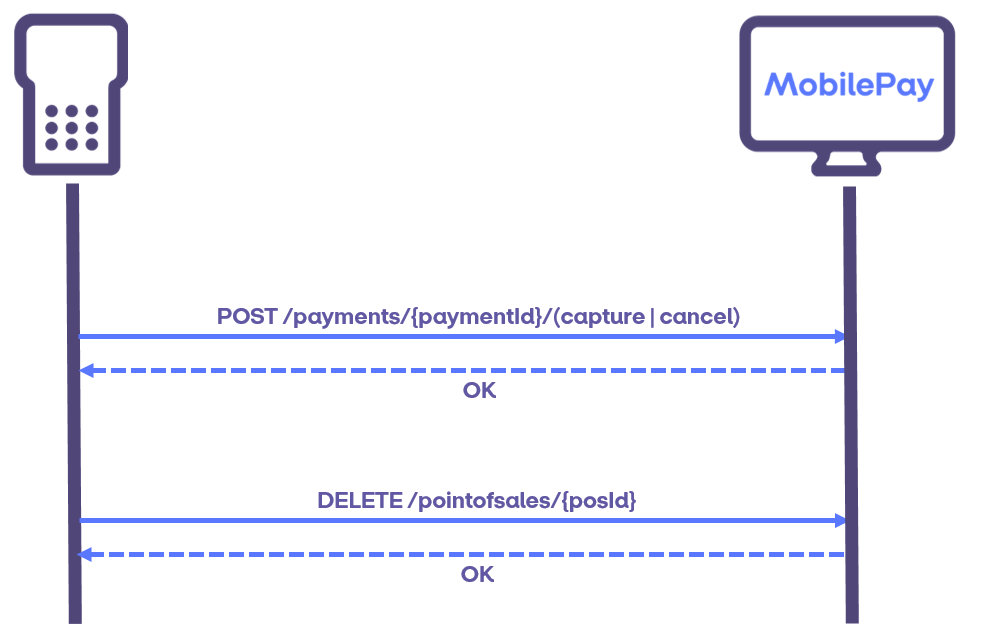

## PoS Management

All payments and check-ins are done on a PoS. This could represent a terminal, a QR code, etc. Our API contains a PoS Management section to handle creation, deletion and querying of a PoS. 

### Onboarding / Creation
The Create endpoint returns a globally unique PosId, which the client will use for calling other endpoints in the API.

The client supplies a MerchantPosId. This ID should be unique for a given integrator/merchant combination, but can be reused if the PoS is deleted. After creation, the MerchantPosId is only used to do lookups. It is possible to lookup the currently active PoS with this MerchantPosId or to lookup a list of all PoSes with this MerchantPosId (including ones that have been deleted). We recommend that a PoS queries their MerchantPosId before onboarding, to check if it already exists.

The client has to supply a store ID. This store ID can be retrieved from the *GET /api/v10/stores* endpoint, using the MerchantBrandId and MerchantLocationId. See [Master Data](#master-data).

The client can supply the name of a PoS. This name is shown in the app when the user is checked in, and on the MobilePay receipt.

The client can supply a BeaconId, or have one generated for them. If the client supplies one, it must be a 15-digit string. If MobilePay generates it, it will be a GUID.

The client can supply a Callback for notifications. The Callback can be either a valid Url or it can contain an Alias preconfigured by MobilePay in collaboration with the integrator. See [Notification service](detecting_mobilePay#notification_service).

The client has to specify supported beacon types. This list is used to keep track of which beacon types are used by the PoS, but is also used by MobilePay to better detect errors and for better customer support.

Note that a PoS is not editable. If the client needs to change something on the PoS (e.g. name, beacon ID, callback URL) they have to delete the existing PoS and create a new one with the changes. Best practice for changing values on a PoS is to re-use the same MerchantPosId.

### Offboarding / Deletion
The PosId is used to delete a PoS. When a PoS is deleted, it is no longer possible to initiate payments on that PoS, and any checked in user will be checked out. Any payments that have reached the Reserved state can still be cancelled or captured. We recommend that any Reserved payments are handled (captured or cancelled) before deletion.

### Lookup
The *GET /api/v10/pointofsales/{posId}* endpoint can be used to lookup what information is registered for a PoS.

The *GET /api/v10/pointofsales* endpoint can be used with a filter to lookup a list of PosIds of PoSes satisfying that filter. The filter can include store ID, beacon ID, MerchantPosId and whether to return inactive PoSes.

### Check-in lookup
The checkin endpoint will tell the client whether a user is checked in and the potential loyalty ids of the user. This can be used for polling, if the clients system expects a check-in before starting a payment. The endpoint also says how long time the client must wait before calling again.

### Master Data
A store is uniquely defined by the combination of MerchantBrandId and MerchantLocationId. Two stores with the same MerchantLocationId but different MerchantBrandIds are not related in any way. The MerchantBrandId, MerchantLocationId and StoreId are supplied by MobilePay when the Merchant/Store is onboarded. 

TODO id hierarchy
