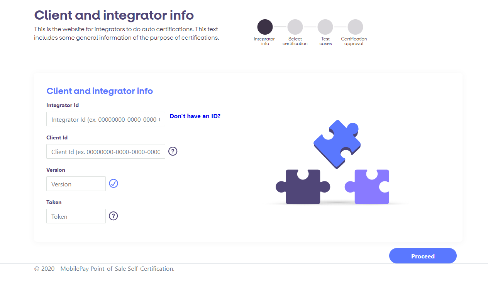
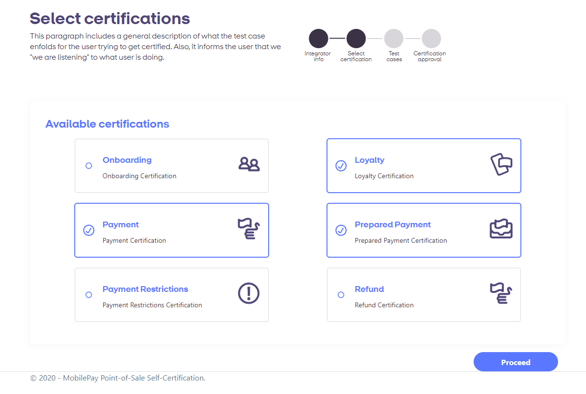
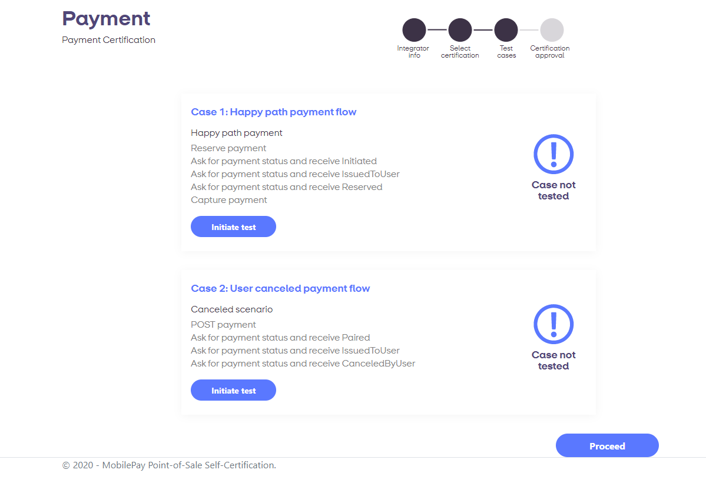

##  Self Certification

The certification process changes with API V10. For the new API all minor and major versions of clients 
must be certified. MobilePay will provide an automatic certification process where it will be possible 
for most integrators to create a fully automated self-certification. The certification will be concluded 
with an automated report on how the certification went.

The Self Certification process has 4 steps; Identification, Selection, Certification and Approval.

### Identification Step
In the first step the Integrator identifies himself in the tool. The following information is needed:
* Integrator ID - ID received from MobilePay per mail, which identifies the Integrator organisation itself. Each Integrator should only have 1 Integrator ID.
* Client ID - ID created on the MobilePay Developer Portal which identifies the cleint to be certified. Each Integrator is allowed to create multiple Client IDs, however it is also acceptable to have just 1 Client ID.
* Version numbering - The three dimensional number that defines the version of the Client that needs to be certified. See [api_principles#client_identification](client_identification)
* Access token - The token that grants access to the POS API. The token can be obtained through an HTTP endpoint.

### Selection Step
In the second step the Integrator selects which major features to certify. There are 6 major features in MobilePay PoS:
* Onboarding - The neccesary proces of creating a Point-of-Sale on the MobilePay backend
* Payment - Certification in sections of the API neccesary for doing a simple payment.
* Prepared Payment - Certification in sections of the API neccesary for doing a prepared payment.
* Refund - Certification in sections of the API neccesary for doing a refund.
* Loyalty - Certification in sections of the API neccesary for handling Loyalty programmes.
* Payment Restrictions - Certification in sections of the API neccesary for handling restrictions to payments.

### Certification Step
In the third step the integrator goes through all the different certifiction cases neccesary using his client. In this step it might be neccesary to operate the client to go through the different steps of a certification case.

### Approval step
In the Fourth and final step the Integrator gets a report informing her of the client performance. In the case the Certification is passed - it is now possible for the client to access production. In the case of a failure there will be information of which steps that failed.

In general we urge all integrators to use this tool to do continuous testing - it is a requirement to certify when upgrading Major og Minor versions, it is recommended to use the tool when making new build versions as well. The tool will never retract a certification to a client version it has already certified, retraction of certification will always be done as manual evaluation from MobilePay side based on input from production. 

